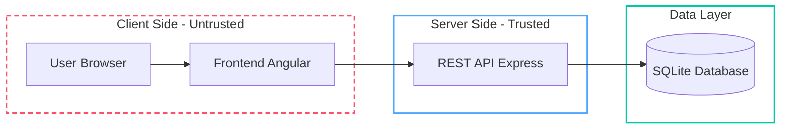

## Diagram Trust Boundary

```mermaid
flowchart LR

    subgraph CLIENT["Client Side - Untrusted"]
        U[User Browser]
        F[Frontend Angular]
        U --> F
    end

    subgraph SERVER["Server Side - Trusted"]
        A[REST API Express]
    end

    subgraph DATA["Data Layer"]
        D[(SQLite Database)]
    end

    F --> A
    A --> D

    style CLIENT fill:none,stroke:#ff4d6d,stroke-width:2px,stroke-dasharray:6 4
    style SERVER fill:none,stroke:#4da6ff,stroke-width:2px
    style DATA fill:none,stroke:#00c9a7,stroke-width:2px
```
